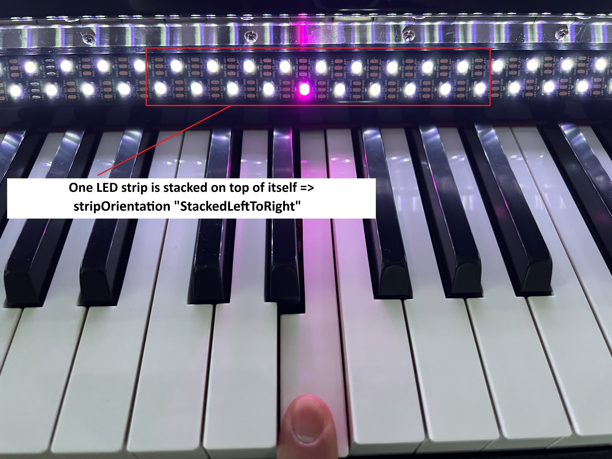
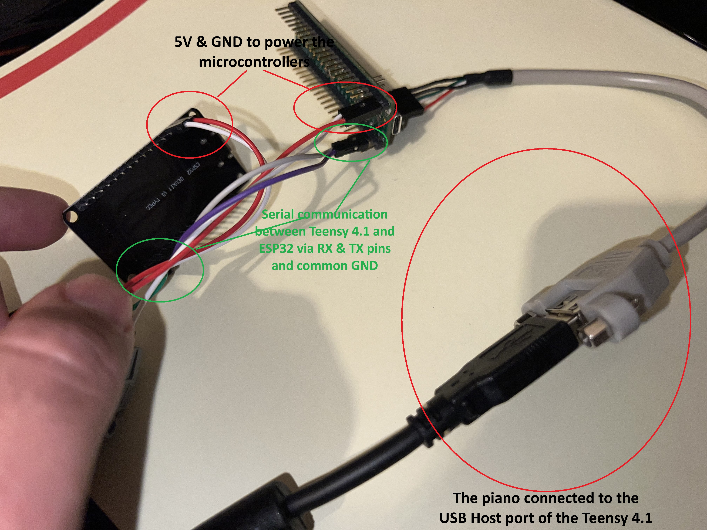

# Teensy USB Host MIDI to WLED Controller

This project is designed to interface a MIDI keyboard or controller connected to a Teensy 4.1 via USB Host with an ESP32 running WLED. It maps MIDI note events to LED colors on a NeoPixel LED strip, creating a visually dynamic lighting effect based on MIDI input.

## Features
- **MIDI Input via USB Host**: Supports MIDI devices connected to the Teensy 4.1's USB host port.
- **WLED Integration**: Communicates with an ESP32 running WLED to control NeoPixel LED strips.
- **Customizable LED Mapping**: Configure LED colors, brightness, and mapping strategies (e.g., velocity-based or note-based).
- **MIDI Channel Filtering**: Specify which MIDI channels to listen to.

## Requirements
### Hardware
1. **Teensy 4.1**: A powerful microcontroller with USB host capabilities.
2. **USB Host Cable**: Available from the [PJRC store](https://www.pjrc.com/store/cable_usb_host_t36.html).
3. **ESP32**: Running WLED (do not use experimental ESP32 variants like the ESP32-C3, see https://kno.wled.ge/basics/compatible-controllers/).
4. **NeoPixel LED Strip like WS2812**: Compatible with WLED for lighting effects.

### Software
1. **PlatformIO**: Used for compiling and uploading the code to the Teensy 4.1.
2. **Control Surface Library**: Add this library to the `lib` folder of the project. **Do not install Control Surface from PlatformIO Registry, as Control Surface will end up using its own MIDI USB library instead of the Teensy's native MIDI USB libraray, which will not work.**

## Setup Instructions
### 1. Install PlatformIO
- Install [PlatformIO](https://platformio.org/) as a plugin for Visual Studio Code.

### 2. Add the Control Surface Library
- Download the [Control Surface library](https://github.com/tttapa/Control-Surface) from GitHub.
- Place the library in the `lib` folder of this project:
```
lib/ 
├── Control_Surface/
``` 
### 3. Hardware Connections
- Connect the USB host cable to the Teensy 4.1's USB host port (see https://www.pjrc.com/store/cable_usb_host_t36.html).
- Connect your MIDI keyboard or controller to the USB host cable.
- Connect the ESP32 running WLED to the Teensy 4.1 via a serial connection (RX & TX pins, default is `Serial1` on the Teensy's side).
- Connect the NeoPixel LED strip to the ESP32 as per the WLED documentation.

### 4. Configure WLED
- Flash WLED onto the ESP32 using the [WLED installation guide](https://kno.wled.ge/).
- The Teensy will send JSON API commands over the Serial pins (RX & TX). This seems to be broken on experimentally supported ESP32s, like the ESP32-C3. **Do not use that kind of ESP32.** Again, see https://kno.wled.ge/basics/compatible-controllers/.

### 5. Compile and Upload the Code
- Open the project in PlatformIO.
- Select the Teensy 4.1 as the target board.
- Compile and upload the code to the Teensy 4.1.

### 6. Customize the Configuration
- Modify the customizable section in `main.cpp` to adjust LED strip settings, color palettes, and MIDI channels. 

Example configuration (with image below):
```cpp
#define WLEDSERIAL Serial1 // Serial port for WLED

// "strips" is a vector - you can have multiple LED strips connected to your ESP32. 
// For each strip connected, add a new entry to this vector
std::vector<PianoLedStrip> strips = {                   
    PianoLedStrip(
        // ledsPerSegment: this is important for segmentConnectionMethod below. Every segment of your strip must be of equal length
        74,          
        // segmentCount: also important for segmentConnectionMethod below 
        2,              
        // ledsPerMeter of the entire strip                                 
        60,                                   
        // wledSegmentOffset - offset for the segment in WLED           
        0,            
        // stripToPianoLengthScale - this is important: scale factor for the strip to match the piano length. You need to play around with this value until the addressed LEDs match the height of the played piano keys. For me, 1.68 works well                                   
        1.68,                                            
        // segmentConnectionMethod - how the segments are connected - see picture below
        // Possible values are Parallal, Serial (if the strip is not stacked on top of each other) or None (if you done use multiple segments for the strip)
        PianoLedStrip::SegmentConnectionMethod::Parallel 
    )
};

// Color palette for the gradient mapping 
std::vector<LedColor> colorPalette = {LedColor::Blue, LedColor::Red};

// Color layout strategy: VelocityBased or NoteBased.
// Velocity Based -> the quieter the note, the closer to the first color of the color palette we get
// Note Based -> the lower the note, the closer to the first color of the color palette we get
PianoToWled::LedStripColorLayout colorLayout = PianoToWled::LedStripColorLayout::VelocityBased;

// Color curve function for mapping velocity/note to color. See gradientcolormapping.h for available functions.
std::function<double(double)> colorCurve = GradientColorMapping::Linear;

// Color for note off event
LedColor noteOffColor = LedColor(255, 255, 255);                                                

// Brightness for note off color
int noteOffColorBrightness = 8; 

// MIDI channels to listen to. Use "allChannels" to listen to all channels. My piano (The Yamaha NU1X) for example uses channels 1 and 2 for the piano keys.
std::vector<uint8_t> midiChannelsToListen = {1, 2};                                 

// Here, you can optionally add which note is the lowest note of your piano. This is used to calculate the offset for the LED strip.
// The default is A0, which is the lowest note of a piano. If you want to use a different note, you can do so here.
std::string lowestKey = "A0"; // Lowest note of the piano
```

#### Example Usage:


## Usage
1. Power on the Teensy 4.1 and ESP32.
2. Connect a MIDI keyboard or controller to the USB host port of the Teensy.
3. Play notes on the MIDI device to see the corresponding LED effects on the NeoPixel strip.




## Notes
- Ensure the Teensy 4.1 and the ESP32, as well as the LED strips are powered adequately, see https://kno.wled.ge/advanced/wiring/
- The project is designed for use with standard ESP32 boards running WLED. Experimental ESP32 variants like the ESP32-C3 do not work due to a bug in WLED causing the ESP32-C3 not to react to any Serial messages.

## Troubleshooting
- If the LEDs do not respond, check the serial connection between the Teensy and ESP32.
- Ensure the MIDI device is recognized by the Teensy. You can add debug messages in the `loop()` function to verify device connection status.

## Dependencies

This project uses the following open source libraries:

- [Control Surface](https://github.com/tttapa/Control-Surface) - Licensed under **GPL-3.0**
- [ArduinoJson](https://arduinojson.org/) - Licensed under **MIT**