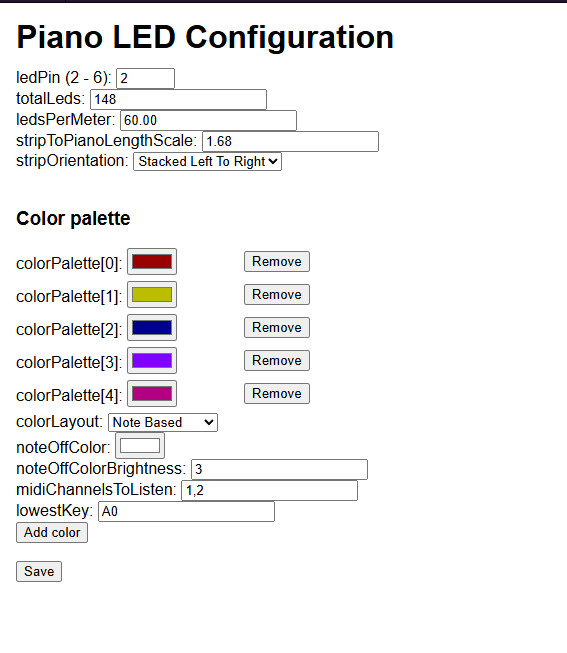
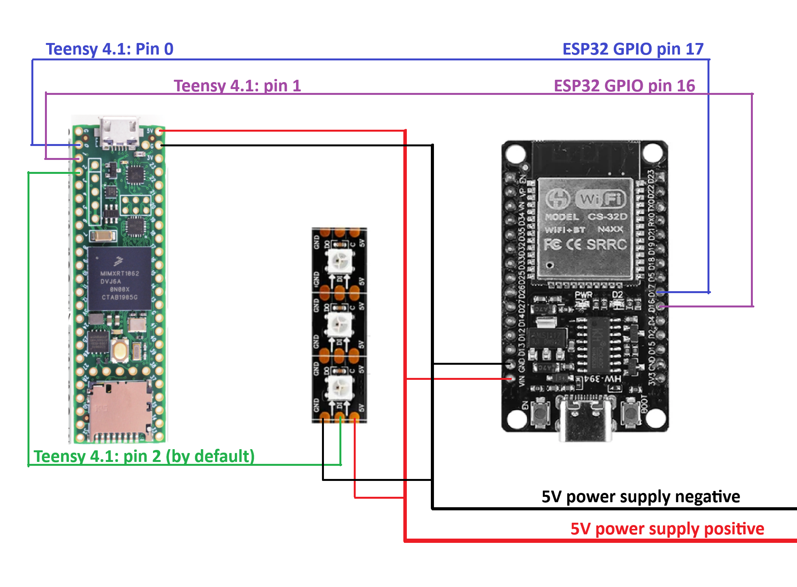

# Piano WLED

This project is designed to interface a MIDI keyboard or controller connected to a Teensy 4.1 via USB Host with an ESP32 running a webserver for configuration. It maps MIDI note events to LED colors on a NeoPixel (WS2812B) LED strip mounted above the piano's keyboard.

[The webserver project is located here](https://github.com/Snake1Byte/Piano-LED-Configurator).

## Features
- **MIDI Input via USB Host**: Supports MIDI devices connected to the Teensy 4.1's USB host port.
- **Webserver for configuration**: Communicates with an ESP32 running a webserver to configure the program.
- **Customizable LED Mapping**: Configure LED colors, brightness, and mapping strategies (e.g., velocity-based or note-based), etc.
- **MIDI Channel Filtering**: Specify which MIDI channels to listen to.

## Requirements
### Hardware
1. **Teensy 4.1**: A powerful microcontroller with USB host capabilities.
2. **USB Host Cable**: Available from the [PJRC store](https://www.pjrc.com/store/cable_usb_host_t36.html).
3. **ESP32**: Running a webserver to configure the program.
4. **NeoPixel LED Strip like WS2812**: Compatible with the FastLED library for lighting effects.

### Software
1. **PlatformIO**: Used for compiling and uploading the code to the Teensy 4.1.
2. **Control Surface Library**: Add this library to the `lib` folder of the project. **Do not install Control Surface from PlatformIO Registry, as Control Surface will end up using its own MIDI USB library instead of the Teensy's native MIDI USB libraray, which will not work.**

## Setup Instructions
### 1. Install PlatformIO
- Install [PlatformIO](https://platformio.org/) as a plugin for Visual Studio Code.

### 2. Add the Control Surface Library
- Download the [Control Surface library](https://github.com/tttapa/Control-Surface) from GitHub.
- Place the library in the `lib` folder of this project:
```
lib/ 
├── Control_Surface/
``` 
### 3. Hardware Connections
- Connect the USB host cable to the Teensy 4.1's USB host port (see https://www.pjrc.com/store/cable_usb_host_t36.html).
- Connect your MIDI keyboard or controller to the USB host cable.
- Connect the ESP32 to the Teensy 4.1 via a Serial connection. The Teensy 4.1 is connected via Serial1 and the ESP32 via HardwareSerial on GPIO pins 17 for TX and 16 for RX.
- Connect the NeoPixel LED strip to the Teensy's pin number 2. This can be changed in the configuration.

### 4. Compile and Upload the Code
- Open the project in PlatformIO.
- Select the Teensy 4.1 as the target board.
- Compile and upload "Piano LED" to the Teensy 4.1.
- Select the ESP32 as the target board.
- Compile and upload "Piano LED Configurator" to the ESP32.

### 5. Customize the Configuration
- Connect to the WiFi access point your ESP32 has created (SSID: "PianoConfigAP", Password: "pianopass").
- Go to the ESP32's webserver's homepage using the ESP32's IP address (likely http://192.168.4.1/) in a web browser and enter your WiFi credentials on thet page.
- Reconnect to your home WiFi.
- Find out what your ESP32's IP address on your home network is. You will likely have to consult your internet modem's settings.
- Open the ESP32's webserver in a web browser using its new IP address (e.g. http://192.168.0.100/) to configure the Piano LED program.


## Example Configuration
This is what the configration page running on the connected ESP32 looks like:


- ledPin: Which pin of the Teensy 4.1 is the LED strip connected to?
- totalLeds: How many LEDs are there in totel on the LED strip?
- ledsPerMeter: How many LEDs are there per meter on the LED strip?
- stripToPianoLengthScale: scale factor for the strip to match the piano length. You need to play around with this value until the addressed LEDs match the height of the played piano key. For me, 1.68 works well.
- stripOrientation: How is the LED strip connected to the piano? LeftToRight, RightToLeft, StackedLeftToRight, StackedRightToLeft (see image below for illustration of StackedLeftToRight). Warning: StackedRightToLeft is not yet implemented.
- colorPalette: Color palette for the gradient mapping (see colorLayout). You can add as many colors as you like.
- colorLayout: VelocityBased or NoteBased. Velocity Based -> the quieter the note, the closer to the first color of the color palette we get. Note Based -> the lower the note, the closer to the first color of the color palette we get.
- noteOffColor: Color for note off event / when a key isn't played.
- noteOffColorBrightness: Brightness for note off color / when a key isn't played.
- midiChannelsToListen: Comma seperated list of MIDI channels to listen to.
- lowestKey: The lowest note of your piano. This is used to calculate the offset for the LED strip. The default is A0, which is the lowest note of a piano. If you want to use a different note, you can do so here (valid inputs are letters A-G followed by an optional #, ♯, b or ♭ followed by a number, with lowest key of the piano being A0).

### stripOrientation "StackedLeftToRight" Example Usage:


## Wiring



## Notes
- Ensure the Teensy 4.1 and the ESP32, as well as the LED strips are powered adequately. A 5V PSU with at least 2A is recommended.

## Dependencies

This project uses the following open source libraries:

- [Control Surface](https://github.com/tttapa/Control-Surface) - Licensed under **GPL-3.0**

# TODO
- Add support for StackedRightToLeft
- Add support for changing the colorCurve (Linear by default)